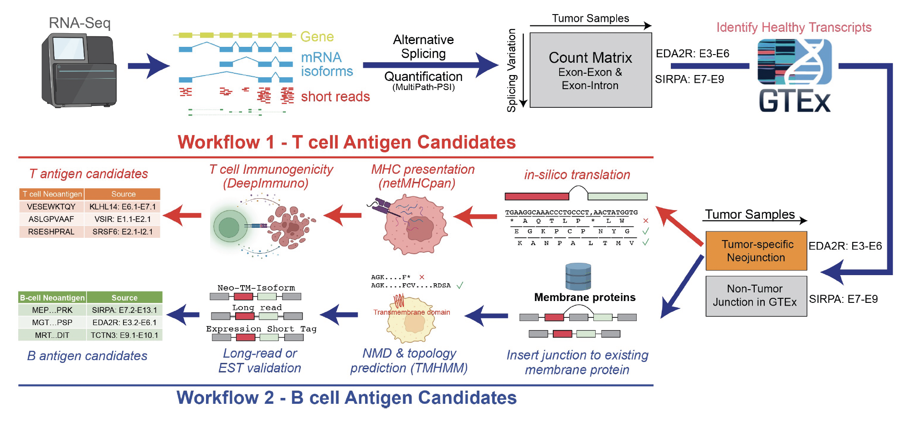

      

# SNAF
Splicing Neo Antigen Finder (SNAF) is an easy-to-use Python package to identify splicing-derived tumor neoantigens from RNA sequencing data, it can 
predict, prioritize and visualize MHC-bound neoantigen for T cell (T antigen) and altered surface protein for B cell (B antigen).

# Tutorial and documentation

[Full Documentation](https://snaf.readthedocs.io)

# Interactive Viewers (below, take a few seconds to load)

  
   

# Input and Output 

Simply put, user needs to supply ``a folder with bam files``, and the ``HLA type`` assciated with each patient (using your favorite HLA typing tool). And it will generate predicted immunogenic MHC-bound peptides and altered surface protein. Moreover, there's a myriad of convenient function that enables users to conduct survival analysis, association analysis and publication-quality visualiztion. Check our tutorials for more detail.

# Citation

[Guangyuan Li, Nathan Salomonis. SNAF: Accurate and compatible computational framework for identifying splicing derived neoantigens [abstract]. Cancer Res 2022;82(12_Suppl)](https://aacrjournals.org/cancerres/article/82/12_Supplement/1898/701846/Abstract-1898-SNAF-Accurate-and-compatible)

A preprint will be released soon.

# Contact

Guangyuan(Frank) Li

Email: li2g2@mail.uc.edu

PhD student, Biomedical Informatics

Cincinnati Children’s Hospital Medical Center(CCHMC)

University of Cincinnati, College of Medicine