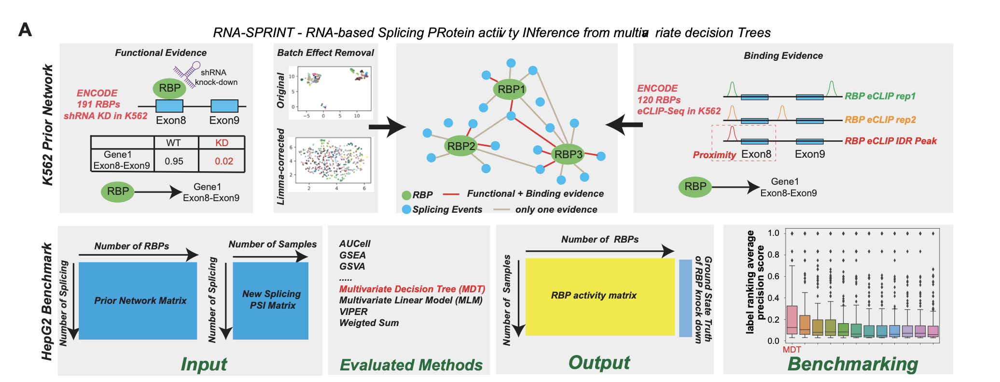

# RNA-SPRINT

RNA-SPRINT is an approach to estimate the RNA binding protein (RBP) activity in each sample. The idea of RNA-SPRINT is simple, we first built a prior network representing the confident relationship between RBP and its targerted splicing junction in K562 data from large-scale knock-down evidence and eCLIP-Seq binding evidence. Using this prior network as basis, we ran Multivariate Decision Tree (MDT) from `decoupler-py` package, which shows consistent better performance in the independent benchmark in HepG2 cell line inference.



The input of RNA-SPRINT is the EventAnnotation file from AltAnalyze results (n_splicing_junctions * n_samples), the output is a `mdt_estimate` file (n_RBPs * n_samples) containing the activity for each RBP in each sample. For the EventAnnotation file, you can follow the first step of the SNAF tutorial, EventAnnotation file will be located at
`altanalyze_output/AltResults/AlternativeOutput/Hs_RNASeq_top_alt_junctions-PSI_EventAnnotation.txt`.

## Dependency

```
# using conda to build a env and pip install following
python=3.8
decoupler==1.2.0
seaborn==0.12.0
skranger
```

We provided a `yml` file to fully reproduce the development environment, I developed this on linux.

## Run the program

To run that, first you need to download the prior network file (`prior.tsv`) from [Synapse](https://www.synapse.org/#!Synapse:syn53038679).

Now you can run like following, modify the path as needed:

```bash
python RNA_SPRINT.py --splicing ./Hs_RNASeq_top_alt_junctions-PSI_EventAnnotation.txt 
--prior ./prior.tsv 
--outdir . 
--meta ./meta.txt 
```

`meta` is a tab-delimited plain text file with all the metadata information associated with each sample, to facilitate direct visualization on [Morpheus](https://software.broadinstitute.org/morpheus/). The `meta` file should be something like below:

```
sample                                                   condition    burden   
sample_name_1_in_your_event_annotation_file              tumor         56
sample_name_2_in_your_event_annotation_file              tumor         90
sample_name_3_in_your_event_annotation_file              control       12
```

Full help prompt is as below by typing `python RNA_SPRINT.py --help`:

```bash
usage: RNA_SPRINT.py [-h] [--splicing SPLICING] [--prop PROP] [--cv CV] [--prior PRIOR] [--meta META] [--outdir OUTDIR]

RNA-SPRINT command line

optional arguments:
  -h, --help           show this help message and exit
  --splicing SPLICING  path to the splicing EventAnnotation file
  --prop PROP          Only include splicing that present above that proportion cutoff
  --cv CV              Only include splicing that preserve covariance coeffieint above this cv cutoff
  --prior PRIOR        path to the downloaded k562 prior network file
  --meta META          path to a metadata file to facilitate the visualization, two or more column, first is sample name, other columns are different
                       metadata, with informati
  --outdir OUTDIR      path to output directory
```

Contact me for any question, I'll be responsive!