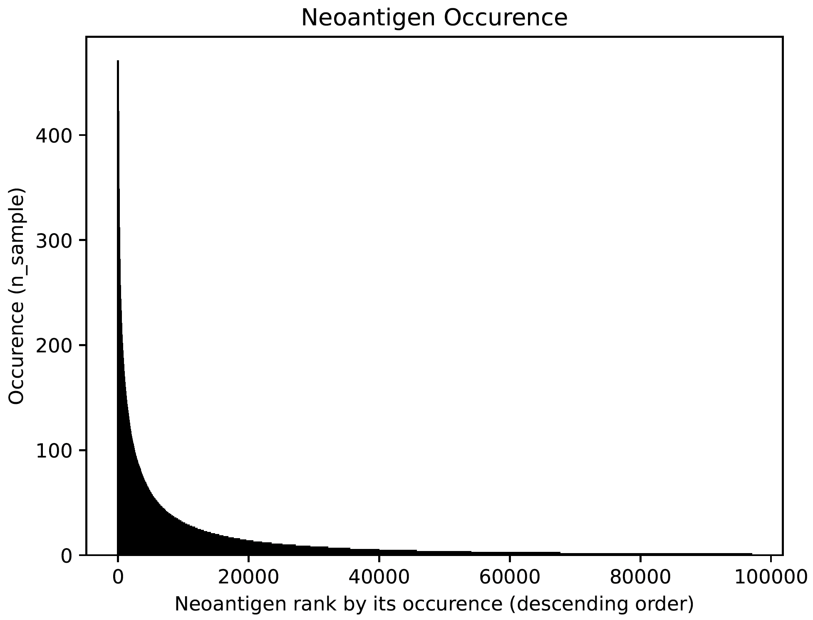
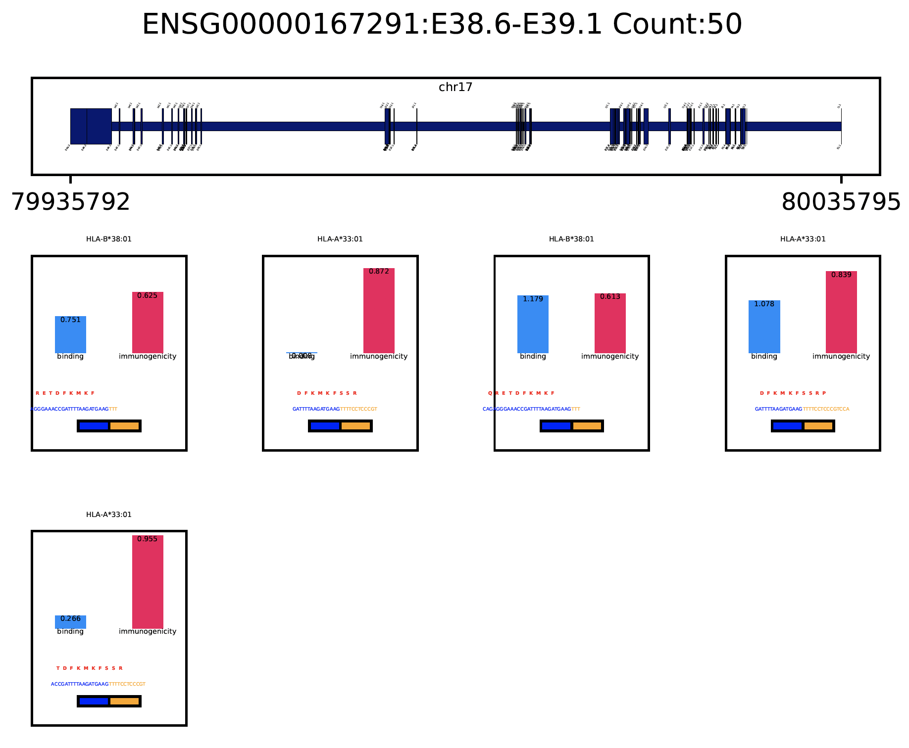
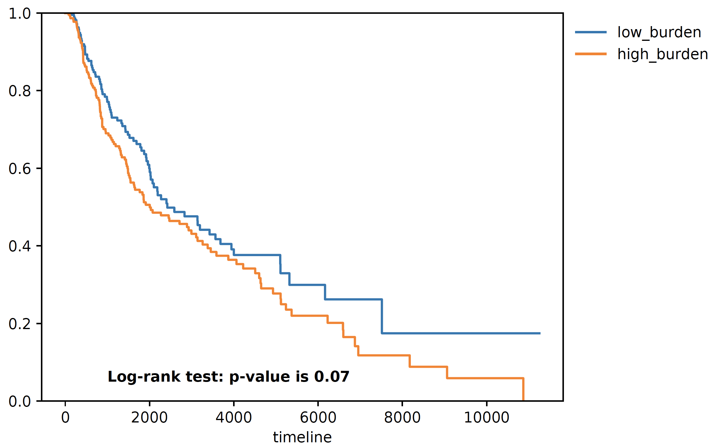
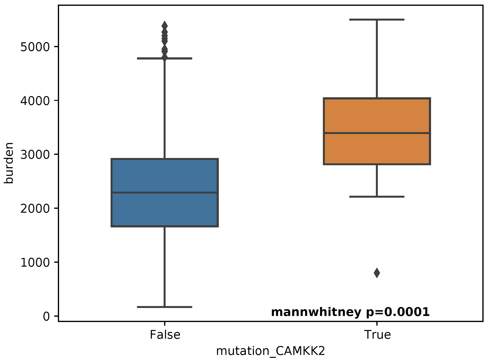
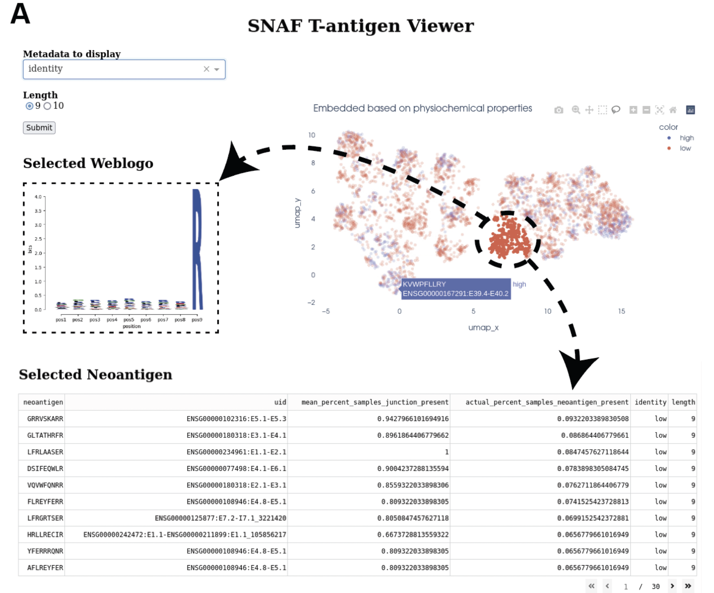
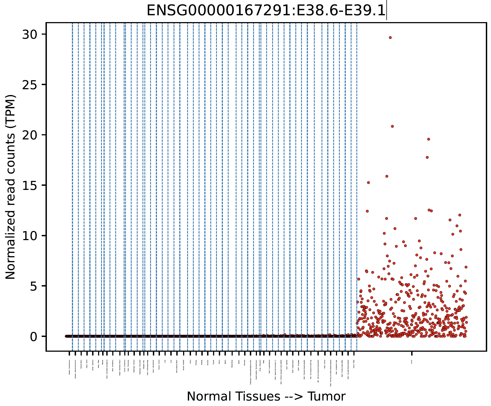
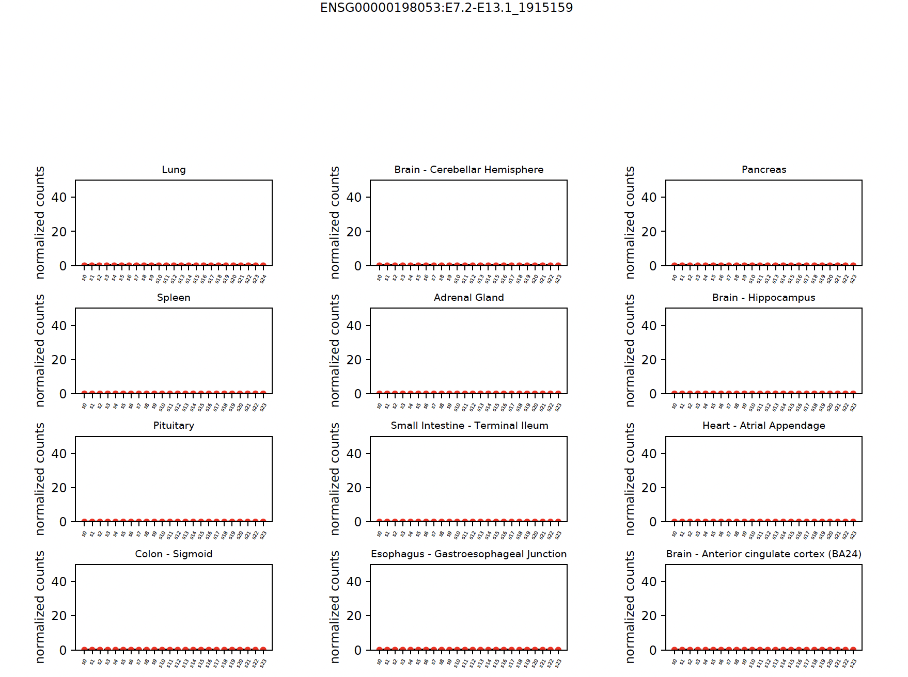

Tutorial
==========

In this tutorial, we will identify the splicing derived neoantigens (both MHC bound T antigens and altered surface B antigens) on 
the TCGA Skin Cutaneous Melanoma (SKCM) cohort (472 tumor samples).

.. note::

    We will use the whole dataset (472 bam files) to demostrate the full functionalities of SNAF. Completing this tutorial will take several
    hours and requires a multi-core High Performance Compute environment (HPC). Please replace the bam file folder with yours and configure your sample 
    HLA type file as illustrated below.

Running AltAnalyze to identify alternative splicing events
-----------------------------------------------------------

The analysis starts with a group of bam files, with each BAM corresponding to single patient sample. For example, if you have all the bam files stored in ``/user/ligk2e/bam``,
the full path to the folder is the only command you need to run in this step::

    docker run -v $PWD:/usr/src/app -t frankligy123/AltAnalyze /user/ligk2e/bam

The output of this step contains different useful readouts, including splicing junction quantification, splicing event quantification and gene expression, but the most important output that will be used
in the following step is the junction count matrix. Let us take a look at a subsampled junction count matrix, each row represent a splicing junction
annotated by the AltAnalyze gene model, and each column represents the sample name. The numerical value represents the number of reads that support the 
occurence of a certain junction. 

.. csv-table:: junction count matrix
    :file: ./_static/sample.csv
    :widths: 10,10,10,10,10,10,10,10,10,10,10
    :header-rows: 1

In the future, we are planning to support user-supplied splicing count matrices from alternative algorithms, which
will increase the compatability of the pipeline with other workflows.

Identify MHC-bound neoantigens (T-antigen)
---------------------------------------------

With the junction count matrix, we can proceed to predict MHC-bound neoantigens (T antigen). The only additional input we need is
the patient HLA type information, in this analyis, we use `Optitype <https://github.com/FRED-2/OptiType>`_ to infer the 4 digit HLA type from RNA-Seq data, the ``sample_hla.txt`` file 
looks like below example (sample_hla.txt)::

                sample	                                                hla
    TCGA-X1-A1WX-06A-11R-A38C-07.bed	HLA-A*02:01,HLA-A*02:01,HLA-B*39:10,HLA-B*15:01,HLA-C*03:03,HLA-C*12:03
    TCGA-X2-A1WX-06A-11R-A38C-07.bed	HLA-A*02:01,HLA-A*01:01,HLA-B*40:01,HLA-B*52:01,HLA-C*03:04,HLA-C*12:02
    TCGA-X3-A1WX-06A-11R-A38C-07.bed	HLA-A*11:01,HLA-A*32:01,HLA-B*40:02,HLA-B*35:01,HLA-C*04:01,HLA-C*02:02
    TCGA-X4-A2PB-01A-11R-A18S-07.bed	HLA-A*02:01,HLA-A*01:01,HLA-B*07:02,HLA-B*18:01,HLA-C*07:01,HLA-C*07:02

In another words, just make sure that you prepare your HLA type information in a file with the same format above.

Loading and instantiating
~~~~~~~~~~~~~~~~~~~~~~~~~~~~~

Load the packages::

    import os,sys
    import pandas as pd
    import numpy as np
    import snaf

The first step is to load our downloaded reference data into the memory to facilitate the repeated retrieval of the data while running::

    # database directory (where you extract the reference tarball file)
    db_dir = '/user/ligk2e/download'  
    # instantiate (if using netMHCpan)
    netMHCpan_path = '/user/ligk2e/netMHCpan-4.1/netMHCpan'
    snaf.initialize(db_dir=db_dir,gtex_mode='count',binding_method='netMHCpan',software_path=netMHCpan_path)
    # instantiate (if not using netMHCpan)
    snaf.initialize(db_dir=db_dir,gtex_mode='count',binding_method='MHCflurry',software_path=None)

Running the T antigen workflow
~~~~~~~~~~~~~~~~~~~~~~~~~~~~~~~

We first instantiate ``JunctionCountMatrixQuery`` object, here the ``df`` is the junction count matrix (a pandas dataframe) that we refer to above.::

    jcmq = snaf.JunctionCountMatrixQuery(junction_count_matrix=df)

We will parse the HLA type ``sample_hla.txt`` file into a nested list. The goal  is to have a python nested list ``hlas``, where each element in 
``hlas`` is another list, for example [HLA-A*02:01,HLA-A*02:01,HLA-B*39:10,HLA-B*15:01,HLA-C*03:03,HLA-C*12:03].  Make sure the order of the element is consistent
with the sample order present in the column of junction count matrix. In another words, if the column of junction matrix is "sample1,sample2,sample3,..",
then make sure the first element in ``hlas`` is the HLA type for sample1, then sample2, sample3::

    sample_to_hla = pd.read_csv('sample_hla.txt',sep='\t',index_col=0)['hla'].to_dict()
    hlas = [hla_string.split(',') for hla_string in df.columns.map(sample_to_hla)]

The main program can be wrapped into one line of code. A folder named ``result`` will be created and the resultant ``JunctionCountMatrixQuery``
object will be saved as a pickle file::

    jcmq.run(hlas=hlas,outdir='./result')

To generate a series of useful outputs including neoantigen burden and neoantigen frequency, we deserialize the pickle file back to memory and automatically
generate these output files::

    snaf.JunctionCountMatrixQuery.generate_results(path='./result/after_prediction.p',outdir='./result')

Now in the ``result`` folder, we can have neoantigen burden files associated with each stage of the workflow. A  ``stage``
refers to different stages in the neoantigen production process, first and foremost, a neoantigen is derived from a neojunction (splicing event), then all potential
peptides will be generated after in-silico translation, followed by MHC presentation and MHC-peptide complex formation to elicit a T cell response. We argue that exporting
neoantigens at each stages are useful for various downstream analyses.

* stage 0: neojunction, the number of tumor-specific junction reads
* stage 1: peptides that are predicted (3-way in-silico translation) from each neojunction
* stage 2: peptides that are predicted to be presented on an MHC molecule (based on netMHCpan or MHCflurry prediction)
* stage 3: peptides that are predicted to be immunogenic (DeepImmuno)

For each stage, you may see the following categories of results:

* burden_stage{0-3}.txt: This file characterizes the patient level neoantigen burden (See below concrete example).
* frequency_stage{0-3}.txt: This file chracterizes each specific neoantigen, how many times does it occur across the whole cohort? 
* frequency_stage{0-3}_verbosity1_uid.txt: This is an enhanced version of frequency.txt file, where each row contains both the neoantigen and the source junction uid.
    This file can be further enhanced by adding gene symbol and chromosome coordinates.
* x_neoantigen_frequency{0-3}.pdf: This is a visual representation of neoantigen frequency as a sorted barplot, where each bar is a neoantigen and the height is its occurence across cohorts.
* x_occurence_frequency{0-3}.pdf: This is an alternative visualization of neoantigen frequency as a histplot, interval (x-axis) with the occurence of each neoantigen across the cohort.

The burden matrix should look like the below, where the last column and last row represent the mean burden for each feature and the total burden for each sample. Since this output only illustrates
the last 10 columns and rows, all of the entries are zero, to give the user a sense of the file layout.

.. csv-table:: burden matrix
    :file: ./_static/burden_stage2_sample.csv
    :widths: 10,10,10,10,10,10,10,10,10,10,10
    :header-rows: 1

Neoantigen frequency plot shows the distinctive pattern between shared neoantigens (left part) and unique neoantigens (right part).

Visualization
~~~~~~~~~~~~~~~~~

A very important question users will want to ask is what splicing event produces a certain neoepitope? We provide a convenient plotting function to achieve this::

    jcmq.visualize(uid='ENSG00000167291:E38.6-E39.1',sample='TCGA-DA-A1I1-06A-12R-A18U-07.bed',outdir='./result')

Survival Analysis
~~~~~~~~~~~~~~~~~~~~~~~

We download the TCGA SKCM survival data from `Xena browser <https://xenabrowser.net/datapages/?dataset=survival%2FSKCM_survival.txt&host=https%3A%2F%2Ftcga.xenahubs.net&removeHub=https%3A%2F%2Fxena.treehouse.gi.ucsc.edu%3A443>`_, 
we provide a convenient function to do a survival analyis using various stratification criteria, To use this function, we need a dataframe (survival) whose index is sample name, along with two columns one representing event (OS.death)
and one representing duration (OS.time). Another is burden, it is a pandas series with sample name as index, and neoantigen burden as values. The sample name needs
to be the same, that's why we need a few lines of code for parsing below::

    survival = pd.read_csv('TCGA-SKCM.survival.tsv',sep='\t',index_col=0)  # 463
    burden = pd.read_csv('result/burden_stage2.txt',sep='\t',index_col=0).loc['burden',:].iloc[:-1]  # 472
    burden.index = ['-'.join(sample.split('-')[0:4]) for sample in burden.index]
    # convenient function for survival
    snaf.survival_analysis(burden,survival,n=2,stratification_plot='result/stage2_stratify.pdf',survival_plot='result/stage2_survival.pdf')

Mutation Association Analysis
~~~~~~~~~~~~~~~~~~~~~~~~~~~~~~~~~

We download the TCGA SKCM mutation data from Xena browser. We provide a convenient function to calculate all associations and plot them. To explain how
this function work, basically, it has two mode, ``compute`` mode is to compute the association between each gene mutation and neoantigen burden. ``plot`` mode
is to visualize selective genes as a side-by-side barplot. For ``compute`` mode, we need the burden file (again, a pandas series, same as described above in survival analysis),
and mutation, which is a dataframe whose index is sample name, and one column represents mutated gene. For ``plot`` mode, just need to specify a list of
genes to plot::

    mutation = pd.read_csv('TCGA-SKCM.mutect2_snv.tsv',sep='\t',index_col=0)  # 467 samples have mutations
    mutation = mutation.loc[mutation['filter']=='PASS',:]
    burden = pd.read_csv('result/burden_stage3.txt',sep='\t',index_col=0).loc['burden',:].iloc[:-1]  # 472
    burden.index = ['-'.join(sample.split('-')[0:4]) for sample in burden.index]
    # mutation convenience function, compute mode
    snaf.mutation_analysis(mode='compute',burden=burden,mutation=mutation,output='result/stage3_mutation.txt',gene_column='gene')
    # mutation convenience function, plot mode
    snaf.mutation_analysis(mode='plot',burden=burden,mutation=mutation,output='result/stage3_mutation_CAMKK2.pdf',genes_to_plot=['CAMKK2'])

.. csv-table:: mutation
    :file: ./_static/stage3_mutation_sample.csv
    :widths: 10,10,10,10
    :header-rows: 1

For a specific mutation ``CAMKK2``, which has been reported that the suppresses expression of this gene, which can increase ferroptosis efficacy and 
anti-PD1 immunotherapy (`paper link <https://pubmed.ncbi.nlm.nih.gov/34242660/>`_), we show that patients with mutated ``CAMKK2`` have higher 
neoantigen burden so that can explain why it lead to better immunotherapy efficacy.

Interactive Neoantigen Viewer
~~~~~~~~~~~~~~~~~~~~~~~~~~~~~~~~~~

Users can launch a dash interactive neoantigen viewer to visualize all the neoantigens based on their physiochemical properties and their motif
composition along with the source splicing junction::

    snaf.downstream.analyze_neoantigens(freq_path='result/frequency_stage2_verbosity1_uid.txt',junction_path='result/burden_stage0.txt',total_samples=472,outdir='result',mers=[9,10],fasta=True)
    snaf.run_dash_T_antigen(input_abs_path='/data/salomonis2/LabFiles/Frank-Li/neoantigen/TCGA/SKCM/snaf_analysis/result/shared_vs_unique_neoantigen_all.txt')

Identify altered surface proteins (B-antigen)
-----------------------------------------------

As a separate workflow, the B-antigen pipeline aims to priotize the altered surface protein from abnormal splicing events.

Instantiating B pipeline
~~~~~~~~~~~~~~~~~~~~~~~~~~~~~~~

We again load some necessary reference data files to RAM::

    from snaf import surface
    surface.initialize(db_dir=db_dir)

Running the program
~~~~~~~~~~~~~~~~~~~~~~~~~

We first obtain the membrane splicing events::

    membrane_tuples = snaf.JunctionCountMatrixQuery.get_membrane_tuples(df)

Then we run the B pipeline::

    # if using TMHMM
    surface.run(membrane_tuples,outdir='result',tmhmm=True,software_path='/data/salomonis2/LabFiles/Frank-Li/python3/TMHMM/tmhmm-2.0c/bin/tmhmm')
    # if not using TMHMM
    surface.run(membrane_tuples,outdir='result',tmhmm=False,software_path=None)

After this step, a pickle file will again be deposited to the ``result`` folder. However, we do want to generate human-readable results::

    # if having gtf file for long-read data
    surface.generate_results(pickle_path='./result/surface_antigen.p',outdir='result',strigency=5,gtf='./SQANTI-all/collapse_isoforms_classification.filtered_lite.gtf') 
    # if not having 
    surface.generate_results(pickle_path='./result/surface_antigen.p',outdir='result',strigency=3,gtf=None)

Different strigencies are explanined below:

* strigency 1: The novel isoform needs to be absent in UniProt database
* strigency 2: The novel isoform also needs to be a documented protein-coding gene
* strigency 3: The novel isoform also needs to not be subjected to Nonsense Mediated Decay (NMD)
* strigency 4: The novel isoform also needs to have long-read or EST support (as long as the novel junction present in full-length)
* strigency 5: The novel isoform also needs to have long-read or EST support (whole ORF needs to be the same as full-length)

Interactive neoantigen viewer
~~~~~~~~~~~~~~~~~~~~~~~~~~~~~~~~~~~

Similar to T antigen, users can explore all the altered surface protein for B antigen::

    surface.run_dash_B_antigen(pkl='result/surface_antigen.p',candidates='result/candidates_5.txt',
                               python_executable='/data/salomonis2/LabFiles/Frank-Li/refactor/neo_env/bin/python3.7')

.. image:: ./_static/b_viewer.png
    :height: 400px
    :width: 600px
    :align: center
    :target: target

Tumor Specificity (GTEx)
----------------------------

For a specific splicing event, we can visualize its tumor specificity by comparing its expression in tumor versus normal tissue::

    snaf.gtex_visual_combine('ENSG00000167291:E38.6-E39.1',norm=True,outdir='result',tumor=df)

here ``norm`` argument controls whether to normalize the raw read count to Count Per Million (CPM) to account for sequencing depth bias.

You can also view each tissue type separately::

    snaf.gtex_visual_subplots('ENSG00000198053:E7.2-E13.1_1915159',norm=True,outdir='result')

