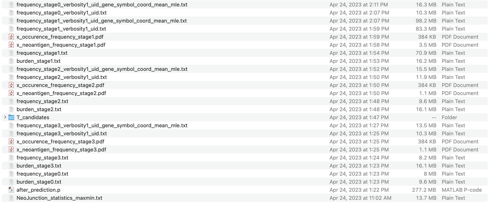
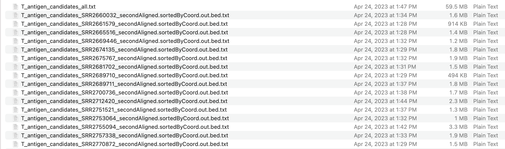
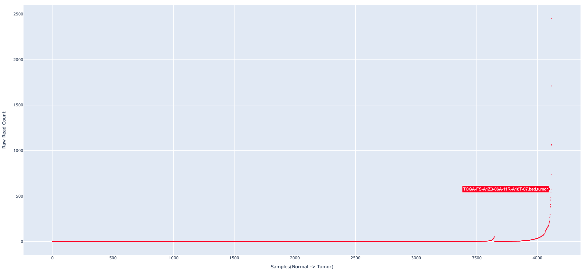
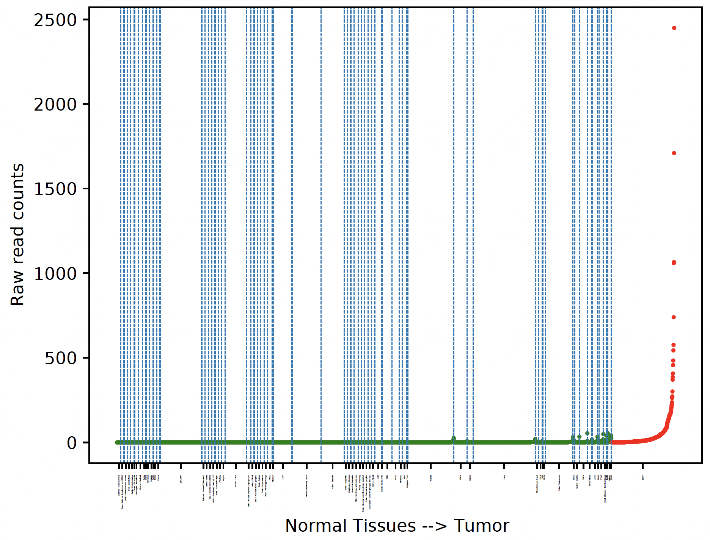
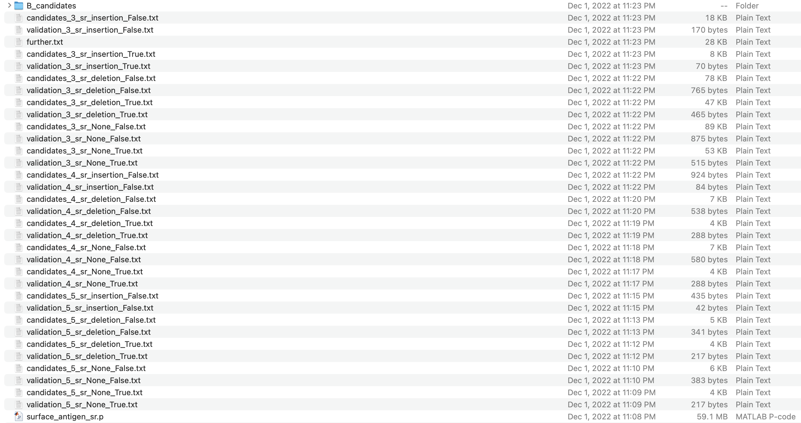
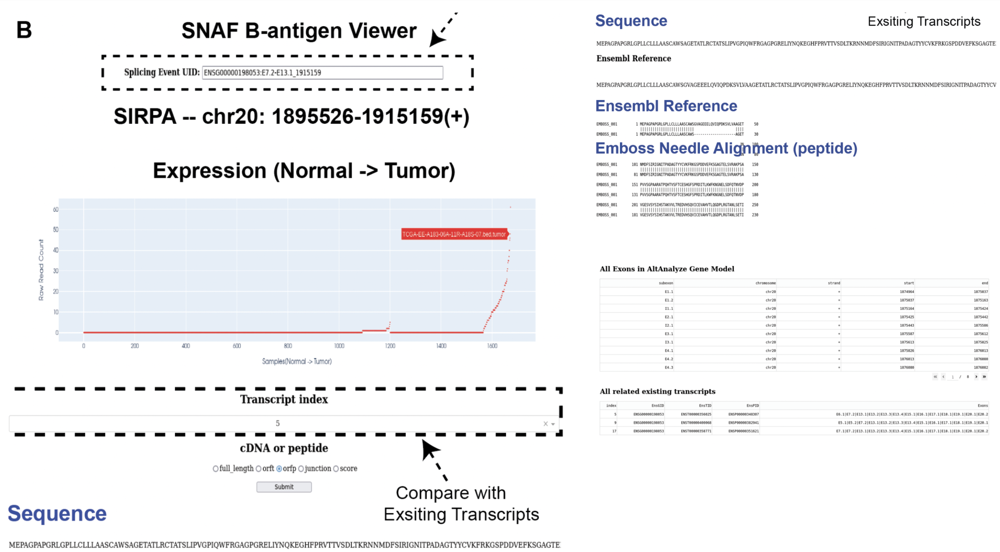

Tutorial
==========

In this tutorial, we will identify the splicing derived neoantigens (both MHC bound T antigens and altered surface B antigens) on 
the TCGA Skin Cutaneous Melanoma (SKCM) cohort (472 tumor samples).

.. note::

    We will use the whole dataset (472 bam files) to demostrate the full functionalities of SNAF. Completing this tutorial will take several
    hours and requires a multi-core High Performance Compute environment (HPC). Please replace the bam file folder with yours and configure your sample 
    HLA type file as illustrated below.

.. warning::

    There are a few steps in the workflow that requires internet connection, especially when launching B-antigen viewer. To avoid any errors, it is recommended 
    to make sure your system has internet connection, which shouldn't be a problem for any computer or HPC.

Running AltAnalyze to identify alternative splicing events
-----------------------------------------------------------

The analysis starts with a group of bam files, with each BAM corresponding to single patient sample. For example, if you have all the bam files stored in ``/user/ligk2e/bam``,
Please make sure you are in ``/user/ligk2e`` and run the following code::

    # using docker
    # -v mount the current folder to the /mnt folder in docker system, so that docker can access your bam folder
    # first argument is the running mode, we set to "identify"
    # second argument is the bam folder, we set to "bam"
    # the third argument is the number of cores to use, we set to 4
    docker run -v $PWD:/mnt -t frankligy123/altanalyze:0.7.0.1 identify bam 4

    # if using singularity, you may have to use singularity/3.1 if you run into any error
    singularity run -B $PWD:/mnt --writable altanalyze/ identify bam 4

.. warning::

    1. What if you only have one bam file? Our original Altanalyze codebase was designed for cohort-level splicing analysis (so at least 2 samples). 
    As a workaround, a quick fix is to copy your bam file to another one (sample.bam, sample_copy.bam), put them all in a folder, then run the pipeline.

    2. Make sure there are no existing folders named ``/bed`` and ``/altanalyze_output`` in the same level of your ``/bam`` folder.

    3. For your bam file, make sure no ``__`` (double underscore) is present as this is a preserved delimiter in the program, just rename it

The output of this step contains different useful readouts, including splicing junction quantification, splicing event quantification and gene expression, but the most important output that will be used
in the following step is the junction count matrix. The junction count matrix will be the ``altanalyze_output/ExpressionInput/counts.original.pruned.txt``. Let us take a look at a subsampled junction count matrix, each row represent a splicing junction
annotated by the AltAnalyze gene model, and each column represents the sample name. The numerical value represents the number of reads that support the 
occurence of a certain junction. 

.. note::

    In ``altanalyze/ExpressionInput`` folder, you will find ``counts.original.full.txt`` and ``counts.original.pruned.txt``, the former is the splicing junction whereas the latter 
    is the alternative splicing events. The latter can better filter out those constitutive junctions (if exon2-exon3 always occur it is a constitutive junction instead of alternative splicing
    event). We recommend using the latter, but when you only have few samples (n<10), using the former can increase the sensitivity.

.. csv-table:: junction count matrix
    :file: ./_static/sample.csv
    :widths: 10,10,10,10,10,10,10,10,10,10,10
    :header-rows: 1

.. note::

    In the future, we are planning to support user-supplied splicing count matrices from alternative algorithms, which
    will increase the compatability of the pipeline with other workflows.

Identify MHC-bound neoantigens (T-antigen)
---------------------------------------------

With the junction count matrix, we can proceed to predict MHC-bound neoantigens (T antigen). The only additional input we need is
the patient HLA type information, in this analyis, we use `Optitype <https://github.com/FRED-2/OptiType>`_ to infer the 4 digit HLA type from RNA-Seq data, the ``sample_hla.txt`` file 
looks like below example::

                sample	                                                hla
    TCGA-X1-A1WX-06A-11R-A38C-07.bed	HLA-A*02:01,HLA-A*02:01,HLA-B*39:10,HLA-B*15:01,HLA-C*03:03,HLA-C*12:03
    TCGA-X2-A1WX-06A-11R-A38C-07.bed	HLA-A*02:01,HLA-A*01:01,HLA-B*40:01,HLA-B*52:01,HLA-C*03:04,HLA-C*12:02
    TCGA-X3-A1WX-06A-11R-A38C-07.bed	HLA-A*11:01,HLA-A*32:01,HLA-B*40:02,HLA-B*35:01,HLA-C*04:01,HLA-C*02:02
    TCGA-X4-A2PB-01A-11R-A18S-07.bed	HLA-A*02:01,HLA-A*01:01,HLA-B*07:02,HLA-B*18:01,HLA-C*07:01,HLA-C*07:02

.. note::

    Optitype is again a tool that is super easy to install as they provide the docker version, the input you need is the fastq file 
    for your patient RNA-Seq sample, just follow their `GitHub instructions <https://github.com/FRED-2/OptiType>`_. You can use your 
    own favorite HLA typing tool as well. All we need is the HLA typing information. I provide the Optitype script I used here: :ref:`reference_to_hla_typing`.

Loading and instantiating
~~~~~~~~~~~~~~~~~~~~~~~~~~~~~

Load the packages::

    import os,sys
    import pandas as pd
    import numpy as np
    import anndata as ad
    import snaf

The first step is to load our downloaded reference data into the memory to facilitate the repeated retrieval of the data while running::

    # read in the splicing junction matrix
    df = pd.read_csv('/user/ligk2e/altanalyze_output/ExpressionInput/counts.original.pruned.txt',index_col=0,sep='\t')

    # database directory (where you extract the reference tarball file) and netMHCpan folder
    db_dir = '/user/ligk2e/download'  
    netMHCpan_path = '/user/ligk2e/netMHCpan-4.1/netMHCpan'

    # demonstrate how to add additional control database, see below note for more
    tcga_ctrl_db = ad.read_h5ad(os.path.join(db_dir,'controls','tcga_matched_control_junction_count.h5ad'))
    gtex_skin_ctrl_db = ad.read_h5ad(os.path.join(db_dir,'controls','gtex_skin_count.h5ad'))
    add_control = {'tcga_control':tcga_ctrl_db,'gtex_skin':gtex_skin_ctrl_db}

    # initiate
    snaf.initialize(df=df,db_dir=db_dir,binding_method='netMHCpan',software_path=netMHCpan_path,add_control=add_control)

.. note::

    RNA expression is tissue specific, which is distinct from DNA mutation, where you just need to compare with one paratumor normal tissue.
    It is important to have a as comprehensive as possible normal tissue database, we initially provide the GTEx database containing >2500 samples
    spanning over 54 tissue types. We further provide TCGA paratumor database an additional GTEx skin tissue for this melanoma analysis. User can 
    add as many h5ad as the normal control. In terms of how to contruct the h5ad or dataframe, please refer to the API->MHC bound peptide(T antigen)
    ->intialize, and the description of the ``add_control`` parameter.

Running the T antigen workflow
~~~~~~~~~~~~~~~~~~~~~~~~~~~~~~~

We first instantiate ``JunctionCountMatrixQuery`` object, here the ``df`` is the junction count matrix (a pandas dataframe) that we refer to above.::

    jcmq = snaf.JunctionCountMatrixQuery(junction_count_matrix=df,cores=30,add_control=add_control,outdir='result')

``cores`` specifies the number of cores to use, ``add_control`` is the additional control database that we refer to above, ``outdir`` is the output directory
where all the results will be stored. The ``JunctionCountMatrixQuery`` object is the main object that will be used in the following steps.

We will parse the HLA type ``sample_hla.txt`` file into a nested list. The goal  is to have a python nested list ``hlas``, where each element in 
``hlas`` is another list, for example [HLA-A*02:01,HLA-A*02:01,HLA-B*39:10,HLA-B*15:01,HLA-C*03:03,HLA-C*12:03].  Make sure the order of the element is consistent
with the sample order present in the column of junction count matrix. In another words, if the column of junction matrix is "sample1,sample2,sample3,..",
then make sure the first element in ``hlas`` is the HLA type for sample1, then sample2, sample3::

    sample_to_hla = pd.read_csv('sample_hla.txt',sep='\t',index_col=0)['hla'].to_dict()
    hlas = [hla_string.split(',') for hla_string in df.columns.map(sample_to_hla)]

.. note::

    The above step depends on how your HLA typing file looks like, so just adjust it accordingly.

The main program can be wrapped into one line of code. A folder named ``result`` will be created and the resultant ``JunctionCountMatrixQuery``
object will be saved as a pickle file::

    jcmq.run(hlas=hlas,outdir='./result')

To generate a series of useful outputs including neoantigen burden and neoantigen frequency, we deserialize the pickle file back to memory and automatically
generate these output files::

    snaf.JunctionCountMatrixQuery.generate_results(path='./result/after_prediction.p',outdir='./result')

Now in the ``result`` folder, your file layout should be as below (amplify the webpage to see more clearly):

``NeoJunction_statistics_maxmin.txt`` contains the filtering step regarding how each junctions were either filered out or retained by each control database. For each stage, it means different 
steps in the neoantigen production:

* ``stage 0``: neojunction, the number of tumor-specific junction reads
* ``stage 1``: peptides that are predicted (3-way in-silico translation) from each neojunction
* ``stage 2``: peptides that are predicted to be presented on an MHC molecule (based on netMHCpan or MHCflurry prediction)
* ``stage 3``: peptides that are predicted to be immunogenic (`DeepImmuno <https://academic.oup.com/bib/article/22/6/bbab160/6261914>`_)

For each stage, you may see the following categories of results:

* ``burden_stage{0-3}.txt``: This file characterizes the patient level neoantigen burden (See below concrete example).
* ``frequency_stage{0-3}.txt``: This file chracterizes each specific neoantigen, how many times does it occur across the whole cohort? 
* ``frequency_stage{0-3}_verbosity1_uid_gene_symbol_coord_mean_mle.txt``: This is an enhanced version of frequency.txt file.
* ``x_neoantigen_frequency{0-3}.pdf``: This is a visual representation of neoantigen frequency as a sorted barplot, where each bar is a neoantigen and the height is its occurence across cohorts.
* ``x_occurence_frequency{0-3}.pdf``: This is an alternative visualization of neoantigen frequency as a histplot, interval (x-axis) with the occurence of each neoantigen across the cohort.

For the final immunogenic neoantigen, we have detailed reports in ``T_candidates`` folder (amplify the webpage to see more clearly), here each row represent
a peptide-HLA combination, so that binding affinity and immunogenicity are also reported.

The burden matrix should look like the below, where the last column and last row represent the mean burden for each feature and the total burden for each sample. Since this output only illustrates
the last 10 columns and rows, all of the entries are zero, to give the user a sense of the file layout.

.. csv-table:: burden matrix
    :file: ./_static/burden_stage2_sample.csv
    :widths: 10,10,10,10,10,10,10,10,10,10,10
    :header-rows: 1

Neoantigen frequency plot shows the distinctive pattern between shared neoantigens (left part) and unique neoantigens (right part).

.. image:: ./_static/neo_freq.png
    :height: 400px
    :width: 500px
    :align: center
    :target: target

Interface to proteomics validation
~~~~~~~~~~~~~~~~~~~~~~~~~~~~~~~~~~~~~~~

Now imagine we have a handful of predicted short-peptides that potentially can be therapeutically valuable targets, as a routine step, we definitely want to test
whether they are supported by public or in-house MS (either untargeted or targetted HLA-bound immunopeptidome) datasets. We provide a set of functions that can make 
this validation process easier.

First, we want to extract all candidate and write them into a fasta file, we iterate all the samples in a for loop, we remove the identical peptides, becasue same peptide can be generated from different junctions.
Next, we want to remove all peptides that are overlapping with human proteome, you can download any preferred human proteome database (UCSC or Uniprot), we provide
a reference fasta `human_uniprot_proteome.fasta` downloaded from Uniprot downloaded at Jan 2020, available at `SNAF GitHub <https://raw.githubusercontent.com/frankligy/SNAF/main/images/proteomics/human_proteome_uniprot.fasta>`_,
we chop them into 9 and 10 mers without duplicates. Then we remove overlapping candidates, all the above is like below::

    jcmq = snaf.JunctionCountMatrixQuery.deserialize('result/after_prediction.p')
    os.mkdir('./fasta')
    snaf.chop_normal_pep_db(fasta_path='../SNAF_ecosystem/snaf_aux/human_uniprot_proteome.fasta',output_path='./fasta/human_proteome_uniprot_9_10_mers_unique.fasta',mers=[9,10],allow_duplicates=False)
    for sample in df.columns:
        jcmq.show_neoantigen_as_fasta(outdir='./fasta',name='neoantigen_{}.fasta'.format(sample),stage=3,verbosity=1,contain_uid=True,sample=sample)
        snaf.remove_redundant('./fasta/neoantigen_{}.fasta'.format(sample),'./fasta/neoantigen_{}_unique.fasta'.format(sample))
        snaf.compare_two_fasta(fa1_path='./fasta/human_proteome_uniprot_9_10_mers_unique.fasta',
                            fa2_path='./fasta/neoantigen_{}_unique.fasta'.format(sample),outdir='./fasta',
                            write_unique2=True,prefix='{}_'.format(sample))

The above assume we want to validate the immunogenic neoantigens (stage 3) identified for each patients. You can certainly construct other fastq files
based on the SNAF-T output, and use the auxiliary functions (``remove_redundant`` and ``compare_two_fasta``) to remove redundant peptides and overlapping peptides.

Usually, MS software requires a customized fasta database, you've already had that right now. Depending on which MS software you use, the configuration steps
can vary, but we recommend using `MaxQuant <https://www.maxquant.org/>`_ here which is highly regarded. MaxQuant requires to compile a configuration files called 
`mqpar.xml` which stores the setting for the search engine, we provide a programatical API to modify the config file based on different instrument, database and 
raw files you are using, below is using Thermo Orbitrap::

    dbs = ['/data/salomonis2/LabFiles/Frank-Li/neoantigen/MS/schuster/RNA/snaf_analysis/fasta/SRR5933726.Aligned.sortedByCoord.out.bed_unique2.fasta']
    inputs = ['/data/salomonis2/LabFiles/Frank-Li/neoantigen/MS/schuster/MS/OvCa48/OvCa48_classI_Rep#1.raw',
              '/data/salomonis2/LabFiles/Frank-Li/neoantigen/MS/schuster/MS/OvCa48/OvCa48_classI_Rep#2.raw',
              '/data/salomonis2/LabFiles/Frank-Li/neoantigen/MS/schuster/MS/OvCa48/OvCa48_classI_Rep#3.raw']
    outdir = '/data/salomonis2/LabFiles/Frank-Li/neoantigen/MS/schuster/MS/OvCa48'
    snaf.proteomics.set_maxquant_configuration(base='mqpar.mxl',dbs=dbs,n_threads=20,inputs=inputs,enzymes=None,enzyme_mode=5,protein_fdr=1,peptide_fdr=0.05,site_fdr=1,
                                               outdir=outdir,minPepLen=8,minPeptideLengthForUnspecificSearch=8,maxPeptideLengthForUnspecificSearch=25)

Above, we need a base 'mqpar.mxl' file to modify upon, we provide a few `base files <https://github.com/frankligy/SNAF/tree/main/maxquant>`_, if your 
MS raw files are not in these formats, you can either contact me or just follow the MaxQuant GUI instructions. A automatically generated configuration 
file (mqpar.xml) will be shown in the outdir that you specified. More information can be found in the :ref:`reference_to_proteomics`.

Visualization
~~~~~~~~~~~~~~~~~

A very important question users will want to ask is what splicing event produces a certain neoepitope? We provide a convenient plotting function to achieve this,
usually we want to first deserialize the resultant pickle object back to memory from last step::

    jcmq = snaf.JunctionCountMatrixQuery.deserialize('result/after_prediction.p')
    jcmq.visualize(uid='ENSG00000167291:E38.6-E39.1',sample='TCGA-DA-A1I1-06A-12R-A18U-07.bed',outdir='./result')

.. image:: ./_static/t_visual.png
    :height: 400px
    :width: 500px
    :align: center
    :target: target

It is also quite important to know the tumor specificity of each junction, which can be visualized in various ways as below::

    # interactive
    snaf.gtex_visual_combine_plotly(uid=uid,outdir='result_new/common',norm=False,tumor=df)
    # static
    dff = snaf.gtex_visual_combine(uid=uid,outdir='Frank_inspection',norm=False,tumor=df)

Survival Analysis
~~~~~~~~~~~~~~~~~~~~~~~

We download the TCGA SKCM survival data from `Xena browser <https://xenabrowser.net/datapages/?dataset=survival%2FSKCM_survival.txt&host=https%3A%2F%2Ftcga.xenahubs.net&removeHub=https%3A%2F%2Fxena.treehouse.gi.ucsc.edu%3A443>`_, 
we provide a convenient function to do a survival analyis using various stratification criteria, To use this function, we need a dataframe (survival) whose index is sample name, along with two columns one representing event (OS.death)
and one representing duration (OS.time). Another is burden, it is a pandas series with sample name as index, and neoantigen burden as values. The sample name needs
to be the same, that's why we need a few lines of code for parsing below::

    survival = pd.read_csv('TCGA-SKCM.survival.tsv',sep='\t',index_col=0)  # 463
    burden = pd.read_csv('result/burden_stage2.txt',sep='\t',index_col=0).loc['burden',:].iloc[:-1]  # 472
    burden.index = ['-'.join(sample.split('-')[0:4]) for sample in burden.index]
    # convenient function for survival
    snaf.survival_analysis(burden,survival,n=2,stratification_plot='result/stage2_stratify.pdf',survival_plot='result/stage2_survival.pdf')

.. image:: ./_static/survival.png
    :height: 400px
    :width: 600px
    :align: center
    :target: target

We can also perform Cox regression analysis to see if the precense of a particular neoantigne is associated with survival or not::

    snaf.downstream.survival_regression(freq='result_new/frequency_stage3_verbosity1_uid_gene_symbol_coord_mean_mle.txt',remove_quote=True,
                                        rename_func=lambda x:'-'.join(x.split('-')[:4]),survival='TCGA-SKCM.survival.tsv',
                                        pea='Hs_RNASeq_top_alt_junctions-PSI_EventAnnotation.txt',outdir='result_new/survival',mode='binary')

.. csv-table:: cox regression
    :file: ./_static/cox.csv
    :widths: 10,10,10,10,10,10
    :header-rows: 1

Mutation Association Analysis
~~~~~~~~~~~~~~~~~~~~~~~~~~~~~~~~~

We download the TCGA SKCM mutation data from `<Xena browser> <https://xenabrowser.net/datapages/?dataset=TCGA-SKCM.mutect2_snv.tsv&host=https%3A%2F%2Fgdc.xenahubs.net&removeHub=https%3A%2F%2Fxena.treehouse.gi.ucsc.edu%3A443>`_. We provide a convenient function to calculate all associations and plot them. To explain how
this function work, basically, it has two mode, ``compute`` mode is to compute the association between each gene mutation and neoantigen burden. ``plot`` mode
is to visualize selective genes as a side-by-side barplot. For ``compute`` mode, we need the burden file (again, a pandas series, same as described above in survival analysis),
and mutation, which is a dataframe whose index is sample name, and one column represents mutated gene. For ``plot`` mode, just need to specify a list of
genes to plot::

    mutation = pd.read_csv('TCGA-SKCM.mutect2_snv.tsv',sep='\t',index_col=0)  # 467 samples have mutations
    mutation = mutation.loc[mutation['filter']=='PASS',:]
    burden = pd.read_csv('result/burden_stage3.txt',sep='\t',index_col=0).loc['burden',:].iloc[:-1]  # 472
    burden.index = ['-'.join(sample.split('-')[0:4]) for sample in burden.index]
    # mutation convenience function, compute mode
    snaf.mutation_analysis(mode='compute',burden=burden,mutation=mutation,output='result/stage3_mutation.txt',gene_column='gene')
    # mutation convenience function, plot mode
    snaf.mutation_analysis(mode='plot',burden=burden,mutation=mutation,output='result/stage3_mutation_CAMKK2.pdf',genes_to_plot=['CAMKK2'])

.. csv-table:: mutation
    :file: ./_static/stage3_mutation_sample.csv
    :widths: 10,10,10,10
    :header-rows: 1

For a specific mutation ``CAMKK2``, which has been reported that the suppresses expression of this gene, which can increase ferroptosis efficacy and 
anti-PD1 immunotherapy (`paper link <https://pubmed.ncbi.nlm.nih.gov/34242660/>`_), we show that patients with mutated ``CAMKK2`` have higher 
neoantigen burden so that can explain why it lead to better immunotherapy efficacy.

.. image:: ./_static/mutation.png
    :height: 400px
    :width: 600px
    :align: center
    :target: target

Interactive Neoantigen Viewer
~~~~~~~~~~~~~~~~~~~~~~~~~~~~~~~~~~

Users can launch a dash interactive neoantigen viewer to visualize all the neoantigens based on their physiochemical properties and their motif
composition along with the source splicing junction. To achieve it, we first run a pre-processing step ``analyze_neoantigens`` to generate
some portable input file for the viewer, we need a file named ``shared_vs_unique_neoantigen_all.txt``. Be sure the specify the full name for this file,
also, the umap plot may take 10 seconds to load if you don't see it loads instantly::

    snaf.analyze_neoantigens(freq_path='result/frequency_stage2_verbosity1_uid.txt',junction_path='result/burden_stage0.txt',total_samples=2,outdir='result',mers=None,fasta=False)
    snaf.run_dash_T_antigen(input_abs_path='/data/salomonis2/LabFiles/Frank-Li/neoantigen/TCGA/SKCM/snaf_analysis/result/shared_vs_unique_neoantigen_all.txt')

.. image:: ./_static/t_viewer.png
    :height: 400px
    :width: 500px
    :align: center
    :target: target

Identify altered surface proteins (B-antigen)
-----------------------------------------------

As a separate workflow, the B-antigen pipeline aims to priotize the altered surface protein from abnormal splicing events.

Instantiating B pipeline
~~~~~~~~~~~~~~~~~~~~~~~~~~~~~~~

We should copy the first part of T antigen pipeline and add additional initialization step for surface antigen::

    import os,sys
    import pandas as pd
    import numpy as np
    import anndata as ad
    import snaf

    # copy the first part of T antigen pipeline

    # read in the splicing junction matrix
    df = pd.read_csv('/user/ligk2e/altanalyze_output/ExpressionInput/counts.original.pruned.txt',index_col=0,sep='\t')
    # database directory (where you extract the reference tarball file) and netMHCpan folder
    db_dir = '/user/ligk2e/download'
    netMHCpan_path = '/user/ligk2e/netMHCpan-4.1/netMHCpan'
    # demonstrate how to add additional control database, see below note for more
    tcga_ctrl_db = ad.read_h5ad(os.path.join(db_dir,'controls','tcga_matched_control_junction_count.h5ad'))
    gtex_skin_ctrl_db = ad.read_h5ad(os.path.join(db_dir,'controls','gtex_skin_count.h5ad'))
    add_control = {'tcga_control':tcga_ctrl_db,'gtex_skin':gtex_skin_ctrl_db}
    # initiate
    snaf.initialize(df=df,db_dir=db_dir,binding_method='netMHCpan',software_path=netMHCpan_path,add_control=add_control)

    # additional instantiation steps
    from snaf import surface
    surface.initialize(db_dir=db_dir)

Running the program
~~~~~~~~~~~~~~~~~~~~~~~~~

We first obtain the membrane splicing events::

    df = pd.read_csv('altanalyze_output/ExpressionInput/counts.original.pruned.txt',sep='\t',index_col=0)
    membrane_tuples = snaf.JunctionCountMatrixQuery.get_membrane_tuples(df,add_control=add_control,outdir='result_new/surface')

There are two modes for running B-pipeline, one is de novo prediction of full isoform from short-read, and validate those prediction by providing an additional long-read gtf.
Alternatively, you can use one of our internal pan-cancer long-read isoform database to predict the full-length isoform. The former is called ``short_read`` mode, the latter is called 
``long_read`` mode::

    # short_read mode
    surface.run(uids=membrane_tuples,outdir='result_new/surface',prediction_mode='short_read',
                gtf=None,
                tmhmm=True,software_path='/data/salomonis2/LabFiles/Frank-Li/python3/TMHMM/tmhmm-2.0c/bin/tmhmm')
    surface.generate_full_results(outdir='result_new/surface',mode='short_read',
                                  freq_path='result_new/frequency_stage0_verbosity1_uid_gene_symbol_coord_mean_mle.txt',
                                  validation_gtf='/data/salomonis2/LabFiles/Frank-Li/neoantigen/TCGA/SKCM/snaf_analysis/SQANTI-all/collapse_isoforms_classification.filtered_lite.gtf')

    # long_read mode
    surface.run(uids=membrane_tuples,outdir='result_new/surface',prediction_mode='long_read',
                gtf='/data/salomonis2/LabFiles/Frank-Li/refactor/data/2021UHRRIsoSeq_SQANTI3_filtered.gtf',
                tmhmm=True,software_path='/data/salomonis2/LabFiles/Frank-Li/python3/TMHMM/tmhmm-2.0c/bin/tmhmm')
    surface.generate_full_results(outdir='result_new/surface',mode='long_read',
                                  freq_path='result_new/frequency_stage0_verbosity1_uid_gene_symbol_coord_mean_mle.txt',
                                  validation_gtf=None)

In your result folder, if running short_read mode, you will be able to get following results (amplify the webpage to see more clearly):

Different strigencies are explanined below:

* ``strigency 1``: The novel isoform needs to be absent in UniProt database
* ``strigency 2``: The novel isoform also needs to be a documented protein-coding gene
* ``strigency 3``: The novel isoform also needs to not be subjected to Nonsense Mediated Decay (NMD)
* ``strigency 4``: The novel isoform also needs to have long-read or EST support (as long as the novel junction present in full-length)
* ``strigency 5``: The novel isoform also needs to have long-read or EST support (whole ORF needs to be the same as full-length)

An output called ``candidates.txt`` is what we are looking for, to facilitate the inspection of the result, let's use the B antigen viewer shown below. Also, 
we automatically generate a more readable and publication-quality table for each category of candidates by using :ref:`reference_to_report_B_candidates`.

Particurly, a more human-readable results can be found in ``B_candidates`` folder, you should examine a file named ``sr_str3_report_None_False.txt`` which is a superset for other output,
``str`` controls the strigency, ``deletion/insertion/None`` indicate whether the candidate has deleted or inserted neo-epitope, None is the combination of both. ``False/True`` represents whether
the candidate will be extracellular or not, False is the superset of True.

The long-read mode output is similar and the file names should be self-explanable if you can follow the above clarificaitons.

Interactive neoantigen viewer
~~~~~~~~~~~~~~~~~~~~~~~~~~~~~~~~~~~

Similar to T antigen, users can explore all the altered surface protein for B antigen, we need the ``pickle object`` and the ``candidates`` file,
importantly, please specify the full path to the python executable you use to run your python script::

    surface.run_dash_B_antigen(pkl='result/surface_antigen.p',candidates='result/candidates_5.txt',
                               python_executable='/data/salomonis2/LabFiles/Frank-Li/refactor/neo_env/bin/python3.7')

.. note::

    The reason for specifying python_executable is for using EmBoss Needleman global alignment REST API. As the REST API was provided 
    as a python script, I need the python executable full path to execute the script.

Tumor Specificity (GTEx)
----------------------------

For a specific splicing event, we can visualize its tumor specificity by comparing its expression in tumor versus normal tissue::

    snaf.gtex_visual_combine('ENSG00000167291:E38.6-E39.1',norm=True,outdir='result',tumor=df)

here ``norm`` argument controls whether to normalize the raw read count to Count Per Million (CPM) to account for sequencing depth bias.

.. image:: ./_static/gtex_combine.png
    :height: 400px
    :width: 500px
    :align: center
    :target: target

You can also view each tissue type separately::

    snaf.gtex_visual_subplots('ENSG00000198053:E7.2-E13.1_1915159',norm=True,outdir='result')

.. image:: ./_static/gtex_subplots.png
    :height: 400px
    :width: 500px
    :align: center
    :target: target

.. note::

    SNAF also provide quantitative measurement for tumor specificity, to calculate the tumor specificity for each neojunction, 
    we need to run :ref:`reference_to_add_specificity`. We can report mean GTEx read count, Maximum likelihood Estimation and hierarchical Bayesian estimation,
    the detailed mathematical equations are shown in the preprint.

.. _reference_to_compatibility:

Compatibility (Gene Symbol & chromsome coordinates)
-------------------------------------------------------

For some historical reasons, different RNA splicing pipeline (i.e. `AltAnalyze <http://www.altanalyze.org/>`_, `MAJIQ <https://majiq.biociphers.org/>`_, 
`rMATs <https://www.pnas.org/doi/10.1073/pnas.1419161111>`_, `LeafCutter <https://www.nature.com/articles/s41588-017-0004-9>`_, etc) use their own
gene model, meaning how they define and index gene and exon number. Hence, a splicing junction (chromsome coordinate like chr7:156999-176000) maybe 
reprensented in diverse annotation in different pipelines.

It is in our to-do list but also requires a lot of work to harmonize all the annotations, for now, we provide functions to convert AltAnalyze annotation
to the most generic representation, namely, ``gene symbol`` and ``chromosome coordinates``. It will be handled by two functions, :ref:`reference_to_add_gene_symbol` and :ref:`reference_to_add_chromsome_coordinate`.

Now let's take the output ``frequency_stage2_verbosity1_uid.txt`` as the example (most important thing is pandas dataframe index format)::

	                                              n_sample
    TQLSVPWRL,ENSG00000258017:E2.3-E2.6	                 470
    QIFESVSHF,ENSG00000198034:E8.4-E9.1	                 463
    MGSKRLTSL,ENSG00000241343:E2.2-E2.4	                 449
    HALLVYPTL,ENSG00000090581:E5.10-E5.24	             435
    QFADGRQSW,ENSG00000111843:E9.1-ENSG00000137210:E6.1	 433
    GIHPSKVVY,ENSG00000263809:E3.1-E4.1	                 432
    RPYLPVKVL,ENSG00000134330:E8.4-E9.1	                 432
    LPPPRLASV,ENSG00000090581:E5.10-E5.24	             428
    SSQVHLSHL,ENSG00000172053:E11.8-E11.11	             425

Let's add gene symbol to the dataframe::

    df = snaf.add_gene_symbol_frequency_table(df=df,remove_quote=True)

.. note:: 

    The ``remove_quote`` argument is due to the fact that in ``frequency.txt`` file, one column is the list of all sample names that contain
    the splicing neoantigen. The thing is, when such a list being re-read into the memory, sometimes a quotation will be added so that the data type
    become a string instead of list, which is not desirable, so if your df is read using ``pd.read_csv``, you need to set it as ``True``,
    otherwise, set it as ``False``.

The resultant will look like that::

    	                                             n_sample	                symbol
    TQLSVPWRL,ENSG00000258017:E2.3-E2.6	                470	               unknown_gene
    QIFESVSHF,ENSG00000198034:E8.4-E9.1	                463	                    RPS4X
    MGSKRLTSL,ENSG00000241343:E2.2-E2.4	                449	                   RPL36A
    HALLVYPTL,ENSG00000090581:E5.10-E5.24	            435	                    GNPTG
    QFADGRQSW,ENSG00000111843:E9.1-ENSG00000137210:E6.1	433	                   TMEM14C
    GIHPSKVVY,ENSG00000263809:E3.1-E4.1	                432	                unknown_gene
    RPYLPVKVL,ENSG00000134330:E8.4-E9.1	                432	                    IAH1
    LPPPRLASV,ENSG00000090581:E5.10-E5.24	            428	                   GNPTG
    SSQVHLSHL,ENSG00000172053:E11.8-E11.11	            425	                   QARS1

Let's add chromsome coorinates to the splicing junction annotation as well::

    df = snaf.add_coord_frequency_table(df=df,remove_quote=False)

Results look like this::

	                                                n_sample	           symbol	         coord
    TQLSVPWRL,ENSG00000258017:E2.3-E2.6	                  470	           unknown_gene	   chr12:49128207-49128627(+)
    QIFESVSHF,ENSG00000198034:E8.4-E9.1	                  463	               RPS4X	   chrX:72256054-72272640(-)
    MGSKRLTSL,ENSG00000241343:E2.2-E2.4	                  449	               RPL36A	   chrX:101391235-101391459(+)
    HALLVYPTL,ENSG00000090581:E5.10-E5.24	              435	               GNPTG	   chr16:1362320-1362452(+)
    QFADGRQSW,ENSG00000111843:E9.1-ENSG00000137210:E6.1	  433	              TMEM14C	   chr6:10728727-10756467(+)
    GIHPSKVVY,ENSG00000263809:E3.1-E4.1	                  432	            unknown_gene	chr17:8376104-8379796(-)
    RPYLPVKVL,ENSG00000134330:E8.4-E9.1	                  432	                IAH1	    chr2:9484550-9487456(+)
    LPPPRLASV,ENSG00000090581:E5.10-E5.24	              428	                GNPTG	    chr16:1362320-1362452(+)
    SSQVHLSHL,ENSG00000172053:E11.8-E11.11	              425	                QARS1	   chr3:49099853-49099994(-)

